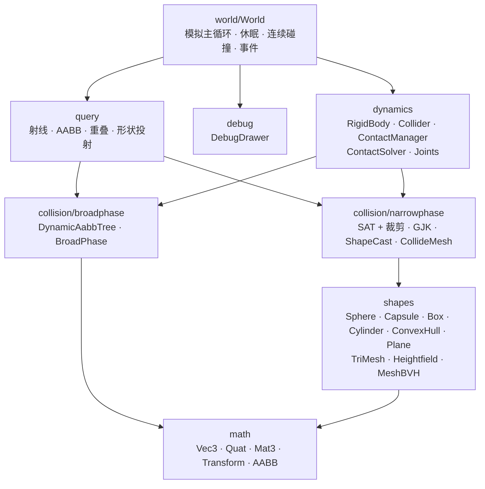
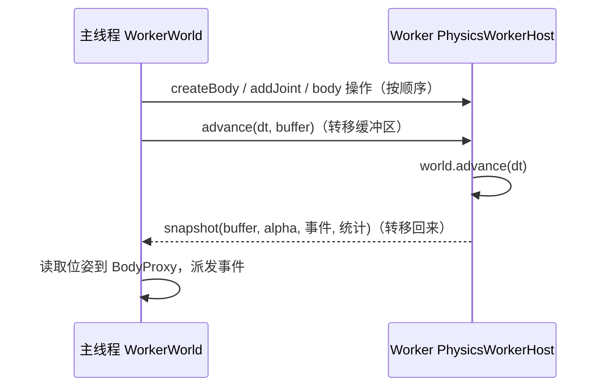
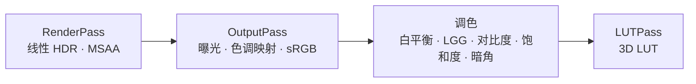

# Thunder Physics 架构说明

## 模块分层



下层不依赖上层；`RigidBody` 等对 `World` 只有类型依赖。

## 一步模拟（`World.step(dt)`）


1. **宽相**：只有扩展包围盒发生变化的代理才重新查询；静态与动态分两棵树，静态之间从不配对。新配对经过过滤（同一刚体、传感器规则、类别掩码、`collideConnected`）后创建 `Contact`。
2. **窄相**：扩展包围盒不再重叠的接触被销毁；双方都休眠 / 静止的接触跳过更新。其余接触重新生成流形，新的接触点先按特征编号、再按局部位置与上一帧匹配（要求法线相近），继承冲量用于 warm start。开始 / 结束接触时排入事件队列，并唤醒被碰到的休眠刚体。
   - **接触缓存**（参考 Jolt 的 body pair cache）：若两刚体的相对位姿自上次完整窄相以来变化小于 1 mm / 2°，且推测距离没有变大，则沿用上次的流形，只用两侧的局部锚点更新接触点与分离距离。静止或缓慢移动的堆叠因此几乎不需要窄相。
3. **求解**：见下一节。
4. **写回**：质心 = 起始质心 + 位移，旋转 = 相对旋转 × 起始旋转；按 `|v| + maxExtent·|ω|` 更新休眠计时。
5. **连续碰撞**：本步位移超过 `0.5 × minExtent` 的动态刚体，把碰撞体从起点沿位移投射到静态物体（`isBullet` 还包括动态物体），命中则回退到撞击时刻；起点已接触（t = 0）的命中交给推测接触处理。对网格只投射质心本步结束时距三角形平面不足 `0.5 × minExtent`（即将深度穿透或穿过）的三角形，起点已接触时改用质心处半径 `0.25 × minExtent` 的小球投射，避免在起伏地形上反复回退造成卡顿（参考 Box2D v3）。
6. **更新宽相**：包围盒超出扩展包围盒时重新插入，并沿速度方向预测一步。
7. **休眠**：用并查集把通过接触 / 关节相连的唤醒刚体分成岛屿，岛内所有刚体静止超过 `timeToSleep` 则整岛休眠。
8. **事件**：`step` 结束后才派发，回调中可以安全修改世界。

## Soft Step 求解器

参考 Box2D v3（Erin Catto，《Solver2D》系列文章）。设整步时长 `dt`，子步数 `n`，子步长 `h = dt / n`。

```
prepare joints; prepare contacts          // 锚点、雅可比、有效质量
for i in 1..n:
  integrate velocities                    // 重力、外力、阻尼、速度上限
  warm start joints; warm start contacts  // 施加上一次的累积冲量
  solve joints (useBias = true)
  solve contacts (useBias = true)
  integrate positions                     // 累积位移 dp 与相对旋转 dq
  relax joints (useBias = false)
  relax contacts (useBias = false)
apply restitution
```

### 软约束

给定刚度 `hertz`、阻尼比 `ζ`、子步长 `h`：

```
ω = 2π·hertz
a1 = 2ζ + hω,  a2 = hω·a1,  a3 = 1 / (1 + a2)
biasRate = ω / a1,  massScale = a2·a3,  impulseScale = a3
```

冲量：`λ = -m_eff · massScale · (Cdot + biasRate · C) - impulseScale · λ_acc`。
接触刚度取 `min(contactHertz, 0.25 × 子步频率)`，与静态物体的接触刚度加倍；关节刚度为接触刚度的 2 倍。

### 接触

- 锚点 `rA = p - cA`、`rB = p - cB` 在准备阶段固定，因此一步内雅可比为常量，可预先计算 `rA×n`、`IA⁻¹(rA×n)` 等，求解时只剩标量运算。
- 当前分离距离由子步内的位移与相对旋转得到：`s = dot(dpB - dpA + dqB·rB - dqA·rA, n) + (s0 - dot(rB - rA, n))`。
- `s > 0`：推测接触，偏置为 `s / h`，允许在本子步内恰好闭合间隙；`s ≤ 0`：软约束推出，推出速度不超过 `contactPushMaxVelocity`。
- 摩擦：两个切向同时求解，按圆盘（`μ·λn`）截断。
- 弹性：求解前记录法向相对速度，所有子步之后若接近速度超过阈值且产生过法向冲量，则施加 `-m_eff·(vn + e·v0)`。
- 求解与 relax 两个阶段以相反顺序遍历接触点，抵消 Gauss-Seidel 顺序带来的不对称（否则对称堆叠也会缓慢侧倾）。

### 关节

关节锚点存储在刚体局部坐标系（相对刚体原点，求解时减去局部质心），子步内由 `center0 + dp`、`dq · rotation0` 得到当前位姿，位置误差用关节软约束修正，relax 阶段只做速度约束。

- 球窝：3×3 点约束块求解。
- 铰链：以创建时的相对旋转为基准，误差旋转分解为**扭转**（绕轴，即铰链角）与**摆动**（按旋转向量锁定为 0，2×2 块求解）；角度限制为推测式单边约束，超出限制时按圆周最近距离选择对应的限制。
- 焊接 / 滑动：相对旋转误差的旋转向量作为 3×3 角约束；滑动关节另有两条垂直方向的平移约束与轴向限制 / 马达。
- 鼠标关节：只作用于 bodyB 的软点约束，冲量按 `maxForce · h` 截断。
- 锥形扭转：与铰链相同的摆动-扭转分解；摆动角（扭转轴偏离初始方向的角度）≤ `swingSpan` 是沿摆动旋转轴的单边推测约束，扭转角限制同铰链；关节摩擦是按 `maxFrictionTorque · h` 截断的三维角速度约束。

## 射线车辆

每步开始前（`WorldController.preStep`）对每个车轮：从悬挂连接点沿车身 -up 做射线检测，得到悬挂长度与接地点；悬挂力 = 车身质量 × (刚度 × 压缩量 − 阻尼 × 悬挂相对速度)。轮胎的侧向冲量按 Bullet `resolveSingleBilateral`（系数 0.2）抵消接地点的横向相对速度，纵向为驱动力或制动（刹停冲量由着地车轮平分并按制动力截断），两者的合力超过 `悬挂力 × frictionSlip` 时按比例缩小并记为打滑。所有力以“整步持续的力”施加（随子步积分），侧向力的作用点按 `rollInfluence` 向质心高度靠拢以减小侧倾。

### 车身可动部件

`VehicleParts` 也是一个世界控制器，每步开始前更新各部件的状态机（`closed → opening → open → closing → closed`），状态只通过改写关节参数起作用，所以部件的运动始终由求解器决定：

- 铰链部件（车门、引擎盖、后备箱）：`closed` 时限位为 [0, 0]（锁止）；`opening` / `closing` 时放开到 [0, openAngle]，由带最大扭矩的马达转动，接近目标角度后切换状态。`open` 状态下，`free` 模式关闭马达任其摆动，角度回到 0 附近时重新锁止（车门被甩上）；`hold` 模式让马达继续朝打开限位推，抵消重力。
- 滑动部件（天窗、尾翼）：滑动关节，同样用锁止限位加马达。
- 雨刮：铰链马达在 [0, sweep] 之间往复，到达两端时反向；停止时先转回 0 再锁止。

`RigidBody` 的 `mass` 按比例同时缩放质量与惯性张量；`centerOfMassOffset` 只移动质心、不改惯性（与 Unity / Jolt 一致），车辆用它降低质心。

## 碰撞检测

### 宽相

`DynamicAabbTree` 移植自 Box2D：叶子存放扩展 `margin`（默认 0.1 m）的包围盒，小幅移动无需更新；插入时按表面积启发式选兄弟节点，回溯时做 AVL 旋转保持平衡。

### 窄相

形状分三类：平面、线段类（球 = 退化线段、胶囊）、多面体（长方体、圆柱、凸包）。

| 组合            | 算法                                                                                                                               |
| --------------- | ---------------------------------------------------------------------------------------------------------------------------------- |
| 线段类 - 线段类 | 线段最近点；近似平行的两根胶囊生成 2 个点                                                                                          |
| 多面体 - 线段类 | 核心分离时用 GJK 距离，若最近特征为面则把线段裁剪到面内得到 2 个点；核心相交时用 SAT（面 + 棱×线段，高斯图剪枝）                   |
| 多面体 - 多面体 | SAT：A 的面、B 的面、棱-棱（Gregorius 高斯图剪枝，预存棱方向与弧法线）；面接触时选入射面并用参考面侧平面做 Sutherland-Hodgman 裁剪 |
| 平面 - 任意     | 核心点 / 顶点对平面的距离                                                                                                          |
| 网格 - 凸体     | 逐三角形：三角形视为“扁平多面体”复用上面的算法（球用最近点专用算法），见下文                                                       |

流形最多 4 个点：先取最深点，再取离它最远的点，再取与前两点构成最大三角形的点，最后取最能扩大面积的点。

### 三角网格与高度场

- **数据结构**：`TriMeshShape` 焊接重复顶点、去掉退化三角形，按三角形包围盒中心的中位数二分建立静态 BVH（叶子 ≤ 4 个三角形，节点平铺在 TypedArray 中）；`HeightfieldShape` 只存高度数组，查询时按格子直接定位，射线检测用二维 DDA 逐格前进。
- **逐三角形碰撞**：凸形状先变换到网格局部坐标系（多面体只变换一次，所有三角形共用），按包围盒查询三角形，经包围盒与三角形平面两级剔除后，三角形作为正反两个面的扁平多面体参与 SAT。扁平多面体的棱在高斯图上是从 n 经过棱外法线 m 到 -n 的半圆，SAT 剪枝拆成两段四分之一圆弧测试。
- **单面**：法线来自背面（`n · 面法线 < 0`）的接触被丢弃。
- **内部棱**：构建时由相邻关系标记每条棱是否活跃（相邻面夹角 > 3° 且为凸棱；边界棱、非流形棱总是活跃）。接触法线不是面法线、且接触点附近的棱都不活跃时：取另一形状沿 -面法线 的最深点，其投影在本三角形内则改用面法线并重算分离距离，否则丢弃（由相邻三角形的面接触负责）。这样物体在拼接的地面上滑动 / 滚动时不会被接缝产生的侧向法线绊住。
- **多流形**：各三角形的接触点按法线分组（夹角 < 5° 的并入同组，法线取平均），组内几乎重合的点只保留较深者，每组约减到 4 个点，至多 8 个流形。求解器对每个接触遍历所有流形。

凸包由增量算法（beneath-beyond）计算，再把共面三角形合并为多边形面，保证面接触能得到完整的裁剪多边形。圆柱用正 N 棱柱近似碰撞几何（与 cannon-es 相同），质量属性按真实圆柱计算。

### GJK 与形状投射

GJK 作用于“核心点集 + 半径”，使用 Johnson 子算法求单纯形最近点（含退化三角形 / 四面体处理）。形状投射使用保守推进：每次用 GJK 求最近距离 `d` 与法线 `n`，沿 `n` 的接近速度推进 `(d - target) / dot(v, n)`，由凸性保证不会越过接触。

## 角色控制器

`CharacterController.move(displacement, dt)` 的流程：

1. **平台携带**：上一步站在运动学 / 动态刚体上时，先按该刚体在接触点的速度移动。
2. **穿透恢复**：对包围盒内的碰撞体生成接触，按最深穿透逐个推出（至多 4 轮）。
3. **水平移动**：着地时先直接滑动；被陡峭表面挡住时尝试迈台阶——向上投射 `stepHeight`、向前滑动、再向下落回，落点可站立（法线可行走，或台阶边缘处射线确认顶面不高于 `stepHeight`）且走得更远才采用。
4. **竖直移动**：向下落在可行走表面上即停（不沿缓坡下滑），撞到朝下的表面记为 `hitCeiling`。
5. **地面检测与贴地**：沿 -up 投射（着地且不在上升时距离为 `snapDistance`），命中可行走表面则着地并吸附到 `skinWidth` 处；先碰到陡峭棱时改用从中心向下的射线寻找地面。
6. **重量**：站在动态刚体上时在接触点施加 `mass × g`。

碰撞并滑动（collide and slide）：沿剩余位移投射形状，停在命中点前 `skinWidth` 处，并沿表面法线保持 `skinWidth` 的间隙；剩余位移去掉指向表面的分量后继续（水平移动时陡坡法线去掉竖直分量，按竖直墙处理；缓坡上保持水平速度大小）；同时贴着两个不同的面时沿交线移动。形状投射在起点已接触时，若平移方向不朝向对方则视为不命中（凸体间距离关于平移参数是凸函数），这样贴着地面或墙滑动不会被当作碰撞。

## Web Worker



- 主线程同步分配刚体编号与快照槽位，命令立即发送，因此创建后马上就能引用；刚体销毁后，其槽位要等到之后请求的快照返回才复用，避免读到旧数据。
- 同一时刻只有一个推进请求在途（缓冲区在对方手里），期间 `advance` 只累积时间，下次一起发送，Worker 端再按 `maxStepsPerFrame` 截断，不会积压。
- 查询与自定义命令带请求编号，结果以 Promise 返回；Worker 中抛出的错误会传回并 reject。

## 确定性与性能约定

- 核心代码不使用随机数；刚体、碰撞体、接触都按创建顺序存放在数组中，迭代顺序确定。
- 数学对象可变、带 `out` 参数；热路径不分配对象，模块内复用临时变量。
- 物理量单位为米、千克、秒。

## 渲染层（`@thunder/render`）

物理引擎不依赖任何渲染库；`@thunder/render` 基于 three.js 实现画面，与物理世界的接口只有两处：`PhysicsView` 读取刚体与碰撞体生成网格、`LightRig.attachToBody` 读取刚体位姿驱动光源，二者都使用 `body.interpolate(alpha)` 与固定步长的物理保持平滑。



- 曝光与色调映射作用于线性 HDR 画面；其余调色在色调映射之后的显示空间进行，参数与常见调色软件一致。
- 参数为中性时跳过调色通道，LUT 强度为 0 时跳过 LUT 通道。
- 主光阴影相机以相机注视点为中心，并在光源视平面内按纹素对齐（坐标轴与 three.js 阴影相机 `lookAt` 一致），避免移动时阴影闪烁。

`PhysicsCar` 负责把车模绑定到物理：先按用户给定的 forward / up 建立车身坐标系（F / U / R），把每个节点的顶点投影到这三个轴上得到范围，再从范围推算车轮中心与半径、铰链点（所在边的中点）、铰链轴，以及向外的法线（面板最薄的轴，指向远离车身中心的一侧）；打开方向取 `sign((A × (C − P)) · N)`。车身与部件的碰撞体是节点顶点的近似凸包（退化时用包围盒），共用一个负数碰撞组。渲染上，每个刚体对应 `root` 下的一个锚点 `Group`，节点用 `Object3D.attach` 移入锚点（保持世界变换不变），之后每帧只需按插值位姿更新锚点。驾驶输入在 `preStep` 中转换为车轮的驱动力、制动力与转向角。
